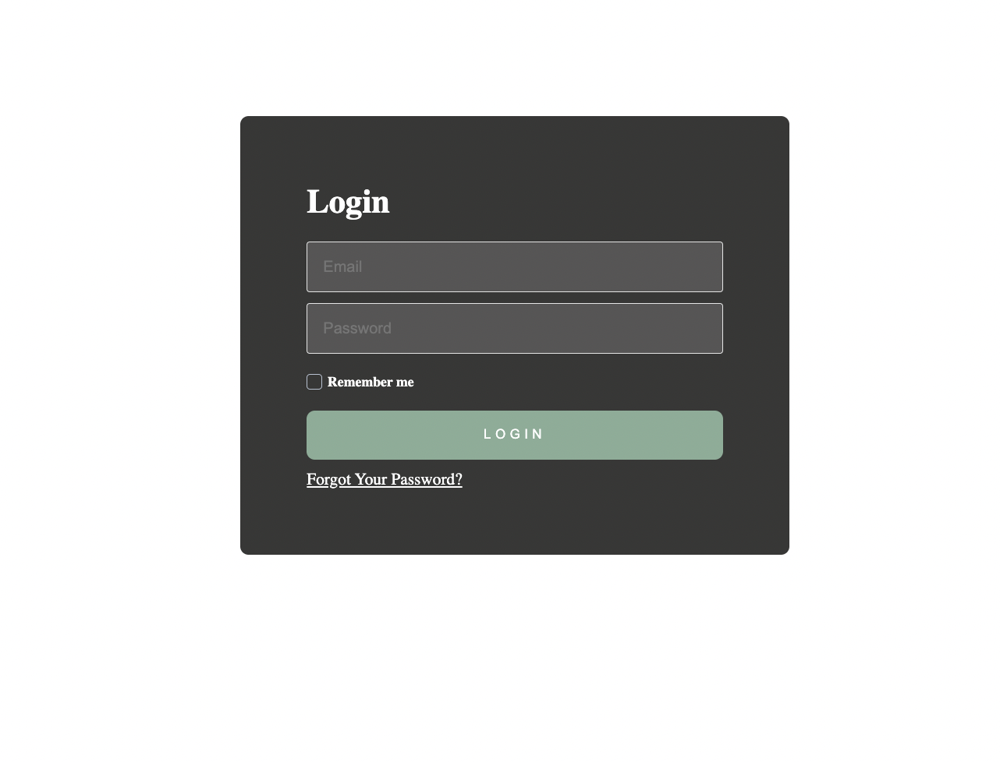
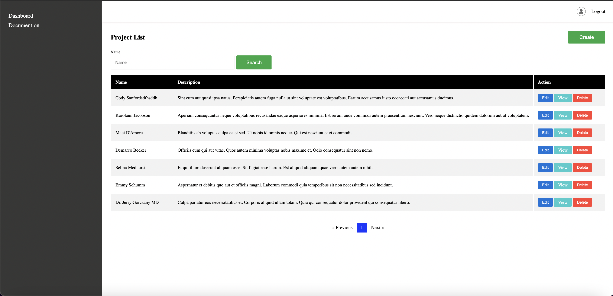
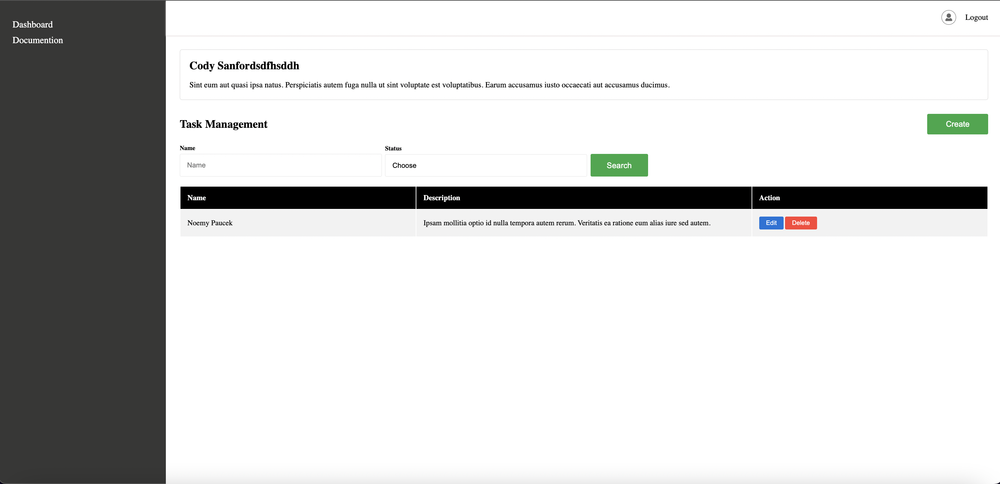
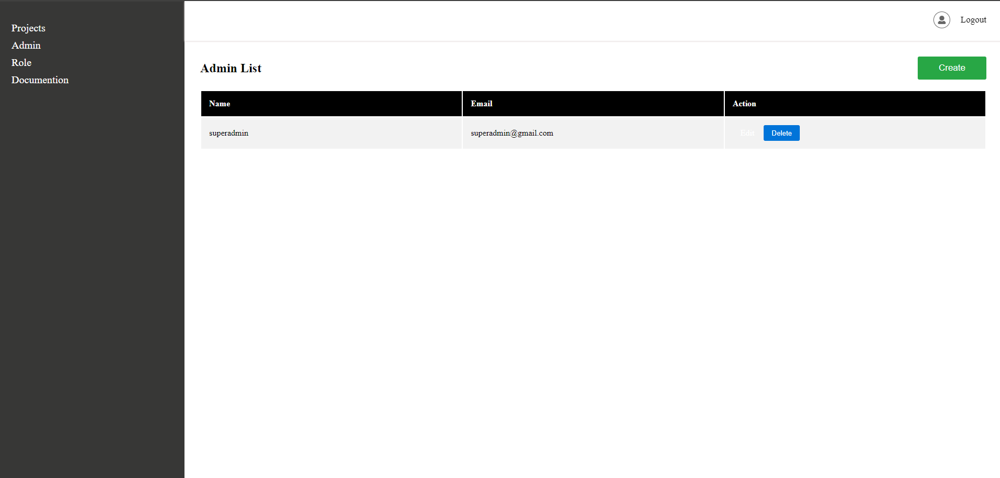
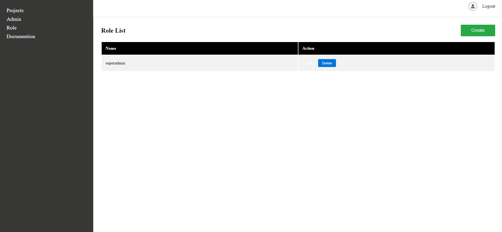

# Project Management Tool Development

> **Note:** This application is designed for your next task. Focus on real-time functionality, Spatie admin permissions, unit tests, etc.

## About the Project
The "Project Management Tool Development" is a comprehensive solution for managing projects and tasks. This application allows users to optimize their workflows and effectively track their projects through various features.

### Technologies and Packages Used
- **Laravel 11:** A PHP-based web development framework.
- **Repository Design Pattern:** The project uses a structure consisting of Interface, Service, and Repository files.
- **Pusher:** For real-time updates.
- **Spatie Laravel Permission:** For user management and permissions.
- **Dockerization:** To containerize the application for a consistent development and deployment environment.
- **Unit Tests:** Unit tests are written for the `projects` and `tasks` tables.

## Installation Instructions
1. **Clone the Repository:**
    ```bash
    git clone https://github.com/yourusername/project-management-tool.git
    cd project-management-tool
    ```

2. **Install the Required Dependencies:**
    ```bash
    composer install
    npm install && npm run dev
    ```

3. **Create the .env File:**
   Copy the `.env.example` file to `.env` and configure your environment settings. Ensure to include the following Pusher configuration:

    ```plaintext
    BROADCAST_CONNECTION=pusher
    PUSHER_APP_ID="1857553"
    PUSHER_APP_KEY="97ec3caf023c69d92924"
    PUSHER_APP_SECRET="d632e96f3944b66879d2"
    PUSHER_HOST=
    PUSHER_PORT=443
    PUSHER_SCHEME="https"
    PUSHER_APP_CLUSTER="ap2"

    VITE_APP_NAME="${APP_NAME}"
    VITE_PUSHER_APP_KEY="${PUSHER_APP_KEY}"
    VITE_PUSHER_HOST="${PUSHER_HOST}"
    VITE_PUSHER_PORT="${PUSHER_PORT}"
    VITE_PUSHER_SCHEME="${PUSHER_SCHEME}"
    VITE_PUSHER_APP_CLUSTER="${PUSHER_APP_CLUSTER}"
    ```

4. **Run Database Migrations and Seeders:**
    ```bash
    php artisan migrate --seed
    ```

5. **Run Unit Tests:**
    ```bash
    php artisan test
    ```

6. **Start the Application:**
    ```bash
    php artisan serve
    ```

## Project Structure and Repository Pattern
This project uses the Repository Design Pattern to keep the codebase clean and maintainable. Each repository handles database operations, while the corresponding services manage business logic using these repositories.

### Repository Structure
- **Interface:** Defines the base contracts for repositories.
- **Service:** Contains business logic and uses the corresponding repository.
- **Repository:** Manages database operations and uses Laravel's ORM.

## Test User Credentials
To test the application, use the following credentials:

- **Username:** superadmin@gmail.com
- **Password:** password


## Screenshots

<p>

<h3> Login Page </h3>



<h3> Project Lists </h3>



<h3> Task Lists </h3>



<h3> Admin Lists </h3>



<h3> Role Lists </h3>



</p>
